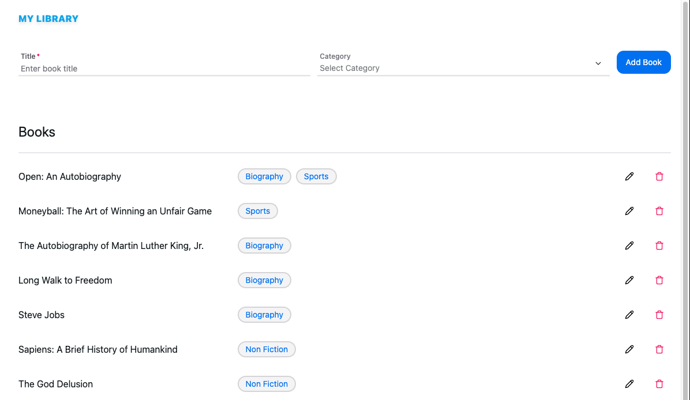

# Books example client


This sample demonstrates a basic books app using Apollo Client. The Server application in [apollo-server-books](https://codesandbox.io/p/github/mujuni88/apollo-server-books/main) communicates with this client.

## Run locally

```shell
yarn install
yarn run dev
```

## Run in CodeSandbox

<a href="https://codesandbox.io/p/github/mujuni88/apollo-client-books/main?fontsize=14&hidenavigation=1&theme=dark">
  
</a>
